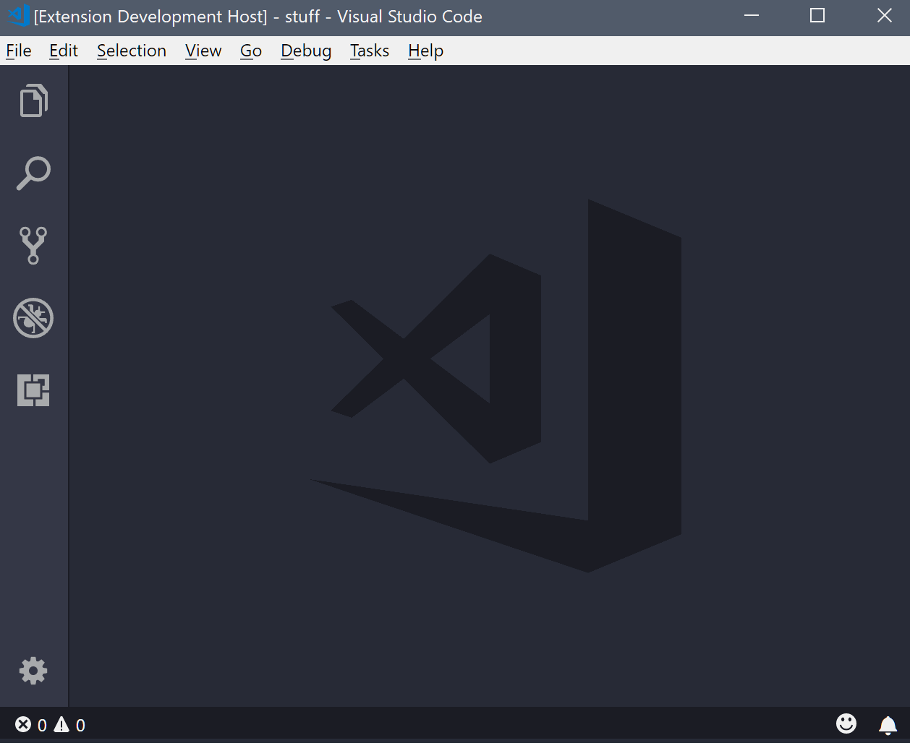
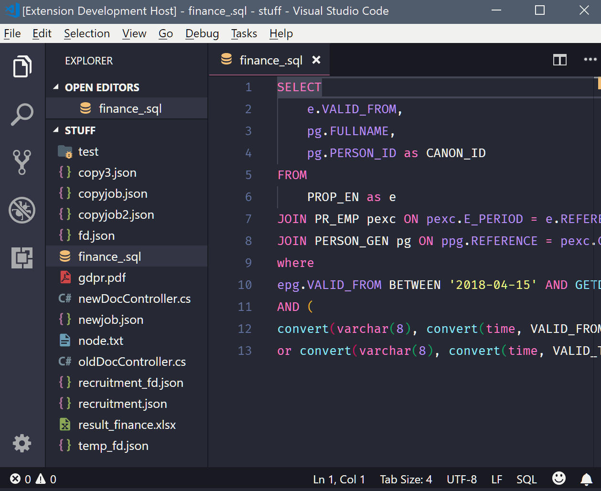
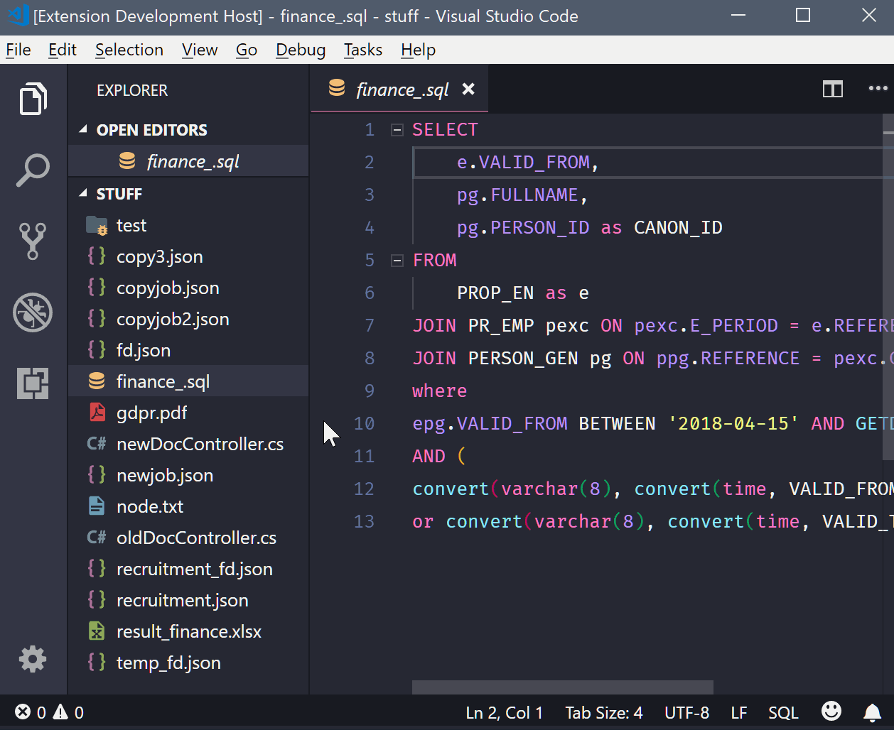
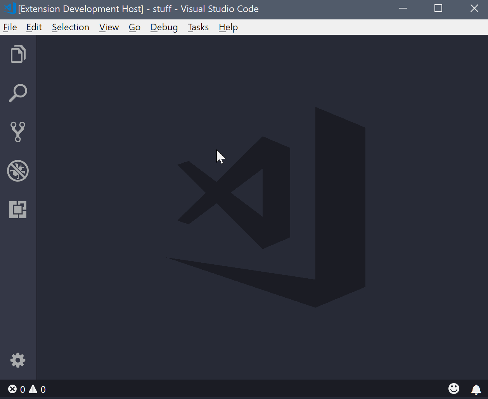
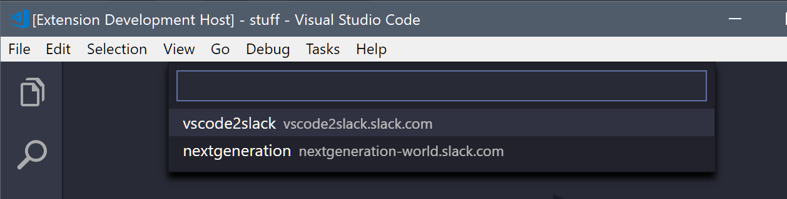

[](https://marketplace.visualstudio.com/items?itemName=siesing.vscode2slack)
[](https://marketplace.visualstudio.com/items?itemName=siesing.vscode2slack)
[](https://marketplace.visualstudio.com/items?itemName=siesing.vscode2slack)

# VSCode 2 Slack - a more personal extension

Ever felt that you're in a flow and don't want to stop coding, but you need to send someone a message or turn off notifications to stay in that flow? Ever felt the need to ask a colleague/friend a question about a certain piece of code? Look no further we've got you covered!

> **_Sends messages and files like yourself, including your username and avatar, to users, channels, and groups with full editing capabilities in Slack._**

> **_Support for multiple Workspaces._**

**Enjoy! :+1:**

*   [Features](#features)
*   [Installation](#installation)
*   [Extension Settings](#extension-settings)
*   [Keyboard Shortcuts](#keyboard-shortcuts)
*   [Screenshots](#screenshots)

## Features

### Key Features

*   Send messages and files to users, channels, and groups like yourself, including your username and avatar.

*   Looks like and behaves like regular Slack messages.

*   Full editing capabilities in Slack of sent messages and files.

*   Support for multiple Workspaces.

#### Send Messages Based On:

*   User input.
*   Text selection.

#### Uplod Files:

*   Files from File Explorer.
*   Current open file in editor.

#### Notifications:

*   Set new or change existing snooze time of notifications.
*   End snoozing of notifications.
*   Check the snooze status.

## Installation

Install by openening Visual Studio Code and press `Ctrl+Shift+X` or `Cmd+Shift+X` to open the Extensions pane and search for VSCode 2 Slack.

## Extension Settings

Set your custom settings under User Settings `(File > Preferences > User Settings)` or by pressing `Ctrl+,` or `Cmd+,`.

```
"slack.workspaces": [{
    "token": "<workspace token>"
}],
"slack.actionNotificationDisplayTime": <time in ms>
```

Settings:

*   `slack.workspaces *(required)*`  
    You find your token(s) here [https://api.slack.com/custom-integrations/legacy-tokens](https://api.slack.com/custom-integrations/legacy-tokens "Get your Slack token(s).").

To use a single Slack workspace.

```
"slack.workspaces": [{
    "token": "<workspace token>"
}]
```

To use multiple Slack workspaces.

```
"slack.workspaces": [{
    "token": "<workspace1 token>"
},{
    "token": "<workspace2 token>"
},{
    "token": "<workspace3 token>"
}]
```

To enable a specific list of channels or users.

```
"slack.workspaces": [{
    "token": "<workspace 1 token>",
    "includedUsers": [
        "userName1",
        "userName2"
    ],
    "includedChannels": [
        "channelName1",
        "channelName2"
    ]
}]
```

*   `slack.token *(DEPRECATED)*`  
    Use the above slack.workspaces instead.
*   `slack.actionNotificationDisplayTime`  
    Notifications display time in ms. Default is **_5000_**, i.e. 5 sec.

## Keyboard Shortcuts

| Action              | Windows  | Mac     |
| ------------------- | -------- | ------- |
| Send Message        | ctrl+u m | cmd+u m |
| Send Selection      | ctrl+u s | cmd+u s |
| Set/Change Snooze   | ctrl+u z | cmd+u z |
| End Snooze          | ctrl+u e | cmd+u e |
| Check Snooze Status | ctrl+u d | cmd+u d |

## Screenshots

Post a message.



Post a selection.



Post file from File Explorer.



Set and check snooze.



If you've added multiple workspaces you'll get this additional selection where you choose the workspace.


